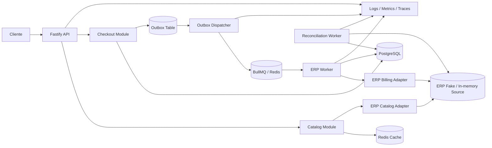
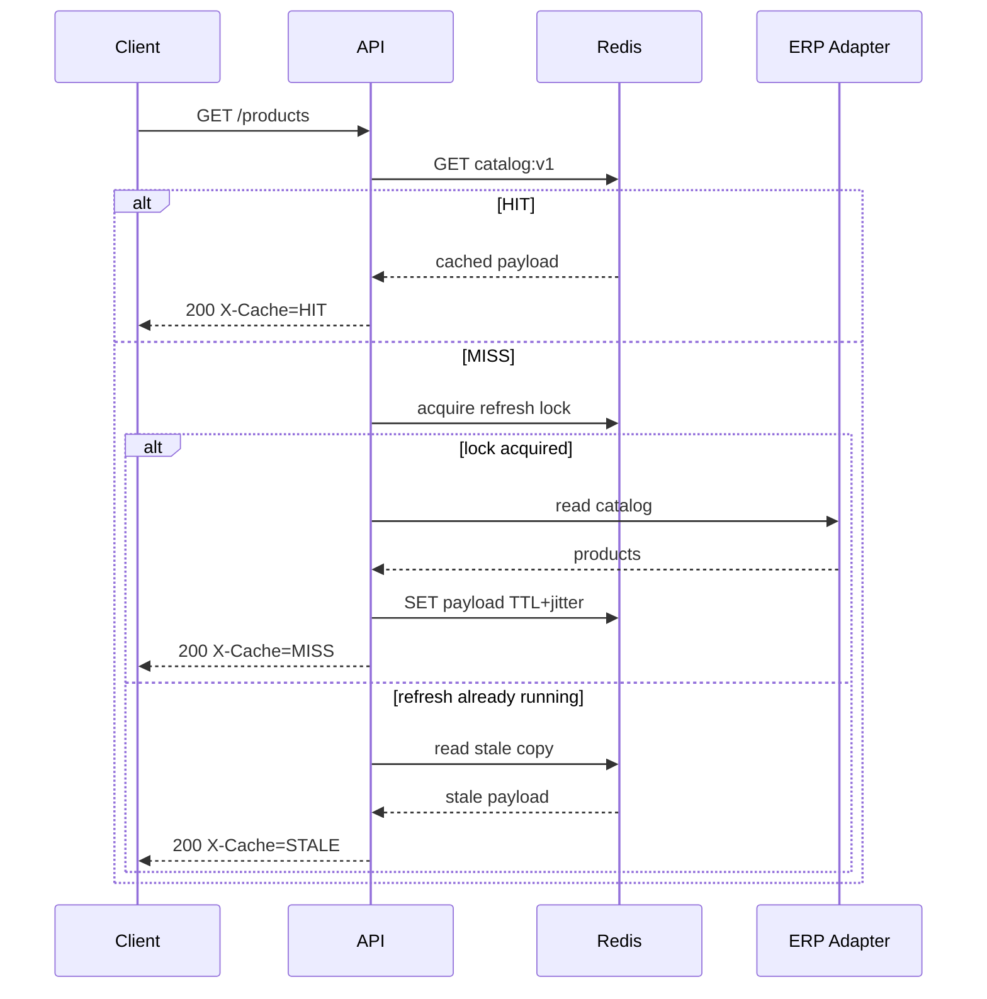
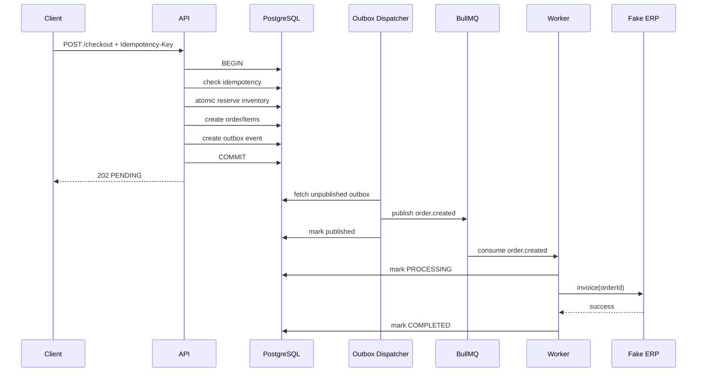

# AGENTS.md — CaseCellShop Backend
## Especificação de implementação agentic-first

> Documento operacional para agentes de código (Codex, Claude Code, Cursor, etc.).
> Este arquivo transforma o desafio técnico CaseCellShop em requisitos implementáveis, arquitetura, backlog, critérios de aceite, sprints e regras de execução.
>
> **Objetivo principal:** entregar uma solução pequena, executável e tecnicamente madura que demonstre cache, observabilidade, concorrência, consistência, idempotência, processamento assíncrono, resiliência e uso criterioso de IA.

---

# 1. Fonte de verdade e escopo

A implementação deve atender integralmente ao case original, cujo escopo prático exige:

- `GET /products` com cache e TTL ou estratégia equivalente.
- `POST /checkout` retornando `202 Accepted` com `orderId` e `status`.
- `GET /orders/{orderId}/status`.
- Contrato OpenAPI com schemas de sucesso e erro.
- Logs estruturados com `correlationId/requestId` e `orderId` quando existir.
- Métricas de cache e processamento de checkout/fila.
- Trace/span ligando request, cache, repositório/fonte de dados e worker.
- Checkout sem overselling.
- Idempotência contra retries/duplo clique/reprocessamento.
- Worker simulando envio ao ERP.
- Testes de negócio, cache e concorrência.
- README com decisões, trade-offs, limitações, execução, observabilidade/runbook e uso de IA.

Fora de escopo:

- autenticação;
- autorização;
- pagamento real;
- frontend;
- deploy real em cloud;
- integração real com ERP;
- modificação do ERP;
- solução distribuída em múltiplos repositórios.

Não expandir o produto além disso sem necessidade técnica explícita.

---

# 2. Decisões arquiteturais obrigatórias

## 2.1 Estilo

Usar **modular monolith** no backend.

Justificativa:

- o desafio é pequeno;
- reduz custo operacional;
- mantém separação de responsabilidades;
- permite demonstrar arquitetura sênior sem introduzir microserviços artificiais;
- workers podem rodar em processo separado usando o mesmo código-base.

## 2.2 Stack de referência

Implementar preferencialmente com:

- Node.js 22+
- TypeScript
- Fastify
- PostgreSQL
- Redis
- BullMQ
- Zod
- OpenAPI/Swagger
- Pino
- OpenTelemetry
- Prometheus/OpenMetrics
- Vitest
- Testcontainers ou Docker Compose para integração
- Docker Compose

Alternativas são permitidas apenas se reduzirem complexidade sem diminuir cobertura técnica.

## 2.3 Componentes



---

# 3. Princípios de projeto

## 3.1 Fonte de verdade

- **Catálogo:** ERP simulado é a fonte upstream.
- **Pedidos:** banco próprio da loja é a fonte de verdade.
- **Reserva de estoque para checkout:** banco próprio da loja controla a quantidade vendável durante o fluxo do desafio.
- **Fila:** mecanismo de transporte; nunca é a fonte de verdade do pedido.
- **Cache:** aceleração; nunca é a fonte de verdade.

## 3.2 Consistência

Não usar o padrão:

```text
SELECT stock
if stock > 0:
    UPDATE stock
```

Isso possui race condition.

Usar atualização atômica condicional no banco:

```sql
UPDATE inventory
SET available = available - :qty,
    reserved = reserved + :qty,
    updated_at = now()
WHERE product_id = :productId
  AND available >= :qty;
```

Sucesso somente quando `rowCount = 1`.

Para múltiplos itens:

1. ordenar os itens por `productId`;
2. abrir transação;
3. reservar todos de forma determinística;
4. se um falhar, rollback completo;
5. criar o pedido;
6. criar registro de idempotência;
7. criar outbox;
8. commit.

## 3.3 Idempotência

`POST /checkout` deve aceitar:

```http
Idempotency-Key: <uuid-ou-string-estável>
```

Regras:

- chave obrigatória;
- unique constraint no banco;
- armazenar hash canônico do payload;
- mesma chave + mesmo payload => retornar o resultado existente;
- mesma chave + payload diferente => `409 Conflict`;
- retries não podem gerar novo pedido;
- duplo clique não pode gerar novo pedido;
- worker também deve ser idempotente por `orderId`.

## 3.4 Transactional Outbox

Não publicar diretamente na fila como única ação após gravar o pedido.

Dentro da mesma transação:

1. reservar estoque;
2. criar pedido;
3. criar itens;
4. registrar idempotência;
5. inserir `outbox_event`.

Depois do commit:

- dispatcher publica o evento;
- marca `published_at`;
- se cair entre publish e mark, republicação deve ser segura porque o consumidor é idempotente.

Isso evita:

- pedido gravado sem mensagem;
- mensagem publicada para pedido inexistente.

---

# 4. Requisitos funcionais

## RF-001 — Listar produtos

### Endpoint

```http
GET /products
```

### Comportamento

- retornar catálogo;
- usar Redis;
- implementar cache-aside;
- TTL configurável;
- adicionar jitter no TTL;
- impedir cache stampede;
- possuir fallback controlado quando a origem ERP estiver indisponível.

### Resposta mínima

```json
{
  "items": [
    {
      "id": "case-iphone-15-black",
      "name": "Case iPhone 15 Black",
      "price": 79.9,
      "available": 10,
      "updatedAt": "2026-09-23T18:00:00.000Z"
    }
  ]
}
```

### Headers úteis

```http
X-Cache: HIT | MISS | STALE
X-Request-Id: ...
```

---

## RF-002 — Iniciar checkout

### Endpoint

```http
POST /checkout
Idempotency-Key: <required>
```

### Request

```json
{
  "items": [
    {
      "productId": "case-iphone-15-black",
      "quantity": 2
    }
  ]
}
```

### Resposta

```http
202 Accepted
```

```json
{
  "orderId": "ord_...",
  "status": "PENDING"
}
```

### Regras

- pelo menos um item;
- `quantity > 0`;
- não aceitar produto inexistente;
- não aceitar quantidade acima do estoque;
- impedir overselling;
- ser idempotente;
- persistir pedido antes do processamento ERP;
- gravar outbox na mesma transação.

---

## RF-003 — Consultar status

### Endpoint

```http
GET /orders/{orderId}/status
```

### Resposta

```json
{
  "orderId": "ord_...",
  "status": "PROCESSING",
  "updatedAt": "..."
}
```

### Estados mínimos

```text
PENDING
QUEUED
PROCESSING
COMPLETED
FAILED
RECONCILIATION_REQUIRED
```

Não inventar estados adicionais sem necessidade.

---

## RF-004 — Processamento ERP assíncrono

O worker deve:

1. consumir `order.created`;
2. marcar pedido como `PROCESSING`;
3. chamar adaptador ERP;
4. suportar timeout;
5. suportar retry com exponential backoff;
6. usar `orderId` como referência idempotente;
7. marcar `COMPLETED` após confirmação;
8. em erro definitivo conhecido, marcar `FAILED`;
9. em resultado incerto, marcar `RECONCILIATION_REQUIRED`;
10. gerar logs, métricas e spans.

---

## RF-005 — DLQ

Após esgotar tentativas:

- enviar job para DLQ;
- registrar motivo;
- incrementar métrica;
- não apagar rastreabilidade;
- pedido não pode permanecer silenciosamente em `PROCESSING`.

---

## RF-006 — Reconciliação

Criar rotina simples de reconciliação para:

- pedidos `RECONCILIATION_REQUIRED`;
- pedidos em `PROCESSING` acima de um limite;
- jobs em DLQ.

A reconciliação deve consultar o ERP fake usando `orderId`.

Resultados possíveis:

- ERP confirma => `COMPLETED`;
- ERP confirma que não processou => requeue controlado ou `FAILED`;
- ERP continua inconclusivo => manter `RECONCILIATION_REQUIRED`.

---

# 5. Requisitos não funcionais

## RNF-001 — Latência

Metas propostas para o desafio:

- `GET /products`
  - cache hit: p95 < 100 ms;
  - cache miss: p95 < 500 ms.
- `POST /checkout`
  - p95 < 300 ms, pois não espera faturamento ERP.
- `GET /orders/:id/status`
  - p95 < 150 ms.

Esses valores são targets internos do projeto, não requisitos fornecidos pelo case.

## RNF-002 — Disponibilidade

A API não deve depender da disponibilidade síncrona do ERP para aceitar um checkout já validado contra o estoque local.

## RNF-003 — Escalabilidade

API e workers devem ser stateless.

Não depender de:

- locks em memória para consistência global;
- Maps globais como estado de negócio;
- memória do processo para idempotência.

## RNF-004 — Segurança básica

Mesmo sem autenticação:

- validar todos os inputs;
- limitar payload;
- sanitizar logs;
- não logar segredos;
- não logar headers sensíveis;
- não expor stack trace no contrato HTTP;
- usar env vars;
- incluir `.env.example`;
- não commitar `.env`.

## RNF-005 — Operabilidade

A aplicação deve possuir:

```text
GET /health/live
GET /health/ready
GET /metrics
```

---

# 6. Estratégia de cache

## 6.1 Implementação

Padrão:

```text
cache-aside + stale fallback + stampede protection
```

Fluxo:



## 6.2 Chaves

```text
catalog:v1:products
catalog:v1:products:stale
lock:catalog:v1:products
```

## 6.3 TTL

Valores iniciais propostos:

```text
fresh TTL: 30 s
stale TTL: 5 min
jitter: ±20%
lock TTL: 5 s
```

Configurar por env.

## 6.4 Stampede

O agente não pode resolver stampede somente com mutex local.

Usar Redis:

```text
SET lock:key <token> NX PX <ttl>
```

Ou primitive equivalente.

## 6.5 Fallback

ERP falhou:

- existe stale => retornar stale e registrar `X-Cache: STALE`;
- não existe stale => responder `503 Service Unavailable`.

Nunca retornar dados inventados.

---

# 7. Modelo de dados

## 7.1 products / inventory

```text
products
- id PK
- name
- price_cents
- source_updated_at
- created_at
- updated_at

inventory
- product_id PK/FK
- available
- reserved
- updated_at
- version
```

## 7.2 orders

```text
orders
- id PK
- status
- total_cents
- idempotency_key
- request_hash
- erp_reference nullable
- error_code nullable
- created_at
- updated_at
```

## 7.3 order_items

```text
order_items
- id PK
- order_id FK
- product_id
- unit_price_cents
- quantity
- subtotal_cents
```

## 7.4 outbox_events

```text
outbox_events
- id PK
- aggregate_type
- aggregate_id
- event_type
- payload_json
- attempts
- published_at nullable
- created_at
```

## 7.5 processed_messages

Opcional, recomendado:

```text
processed_messages
- consumer
- message_id
- processed_at

UNIQUE (consumer, message_id)
```

---

# 8. Contrato de erros

Formato único:

```json
{
  "error": {
    "code": "OUT_OF_STOCK",
    "message": "Insufficient stock",
    "requestId": "req_..."
  }
}
```

Códigos mínimos:

```text
VALIDATION_ERROR            400
IDEMPOTENCY_KEY_REQUIRED    400
PRODUCT_NOT_FOUND           404
ORDER_NOT_FOUND             404
IDEMPOTENCY_CONFLICT        409
OUT_OF_STOCK                409
ERP_UNAVAILABLE             503
INTERNAL_ERROR              500
```

Não retornar detalhes internos.

---

# 9. Estrutura do repositório

```text
.
├─ src/
│  ├─ app/
│  │  ├─ server.ts
│  │  ├─ app.ts
│  │  ├─ config.ts
│  │  └─ plugins/
│  │
│  ├─ modules/
│  │  ├─ catalog/
│  │  │  ├─ catalog.routes.ts
│  │  │  ├─ catalog.service.ts
│  │  │  ├─ catalog.repository.ts
│  │  │  ├─ catalog.cache.ts
│  │  │  ├─ catalog.schemas.ts
│  │  │  └─ catalog.metrics.ts
│  │  │
│  │  ├─ checkout/
│  │  │  ├─ checkout.routes.ts
│  │  │  ├─ checkout.service.ts
│  │  │  ├─ checkout.repository.ts
│  │  │  ├─ checkout.schemas.ts
│  │  │  ├─ checkout.errors.ts
│  │  │  └─ checkout.metrics.ts
│  │  │
│  │  ├─ orders/
│  │  │  ├─ orders.routes.ts
│  │  │  ├─ orders.service.ts
│  │  │  └─ orders.repository.ts
│  │  │
│  │  └─ inventory/
│  │     ├─ inventory.service.ts
│  │     └─ inventory.repository.ts
│  │
│  ├─ integrations/
│  │  └─ erp/
│  │     ├─ erp.port.ts
│  │     ├─ fake-erp.adapter.ts
│  │     └─ erp.schemas.ts
│  │
│  ├─ messaging/
│  │  ├─ queues.ts
│  │  ├─ outbox.dispatcher.ts
│  │  ├─ order.worker.ts
│  │  └─ reconciliation.worker.ts
│  │
│  ├─ observability/
│  │  ├─ logger.ts
│  │  ├─ metrics.ts
│  │  ├─ tracing.ts
│  │  └─ request-context.ts
│  │
│  ├─ shared/
│  │  ├─ errors/
│  │  ├─ http/
│  │  ├─ db/
│  │  └─ utils/
│  │
│  └─ main.ts
│
├─ tests/
│  ├─ unit/
│  ├─ integration/
│  ├─ concurrency/
│  └─ contract/
│
├─ docs/
│  ├─ architecture.md
│  ├─ runbook.md
│  └─ decisions/
│
├─ scripts/
│  ├─ seed.ts
│  └─ smoke.ts
│
├─ docker-compose.yml
├─ Dockerfile
├─ openapi.yaml
├─ README.md
├─ PROMPTS.md
├─ .env.example
└─ package.json
```

Regra: não criar camadas vazias apenas para seguir arquitetura.

---

# 10. Observabilidade

## 10.1 Logging

Usar JSON estruturado.

Campos obrigatórios quando aplicáveis:

```text
timestamp
level
service
env
requestId
correlationId
traceId
spanId
method
route
statusCode
durationMs
orderId
productId
jobId
attempt
event
error.code
```

Não logar corpo completo do checkout por padrão.

Eventos recomendados:

```text
http.request.completed
catalog.cache.hit
catalog.cache.miss
catalog.cache.stale
catalog.refresh.started
catalog.refresh.failed
checkout.accepted
checkout.idempotent_replay
inventory.reservation.failed
outbox.event.created
outbox.event.published
order.worker.started
order.worker.retry
order.worker.completed
order.worker.failed
order.sent_to_dlq
reconciliation.started
reconciliation.completed
```

## 10.2 Métricas

Counters:

```text
http_requests_total
catalog_cache_hits_total
catalog_cache_misses_total
catalog_stale_served_total
checkout_requests_total
checkout_idempotent_replays_total
checkout_out_of_stock_total
orders_completed_total
orders_failed_total
worker_retries_total
dlq_messages_total
reconciliation_total
erp_requests_total
erp_errors_total
```

Gauges:

```text
queue_depth
dlq_depth
orders_processing
outbox_pending
```

Histograms:

```text
http_request_duration_seconds
catalog_load_duration_seconds
checkout_duration_seconds
erp_request_duration_seconds
order_processing_duration_seconds
```

Evitar labels de alta cardinalidade:

NUNCA usar:

```text
orderId
requestId
userId
idempotencyKey
```

como label de métrica.

## 10.3 Tracing

Fluxo `GET /products`:

```text
HTTP GET /products
└─ catalog.getProducts
   ├─ redis.get
   ├─ redis.lock
   ├─ erp.catalog.fetch
   └─ redis.set
```

Fluxo `POST /checkout`:

```text
HTTP POST /checkout
└─ checkout.create
   ├─ db.transaction
   │  ├─ idempotency.lookup
   │  ├─ inventory.reserve
   │  ├─ order.insert
   │  └─ outbox.insert
   └─ response 202
```

Fluxo worker:

```text
bullmq order.created
└─ order.process
   ├─ order.markProcessing
   ├─ erp.invoice
   └─ order.markCompleted
```

Propagar `traceparent` ou contexto equivalente no payload da mensagem.

---

# 11. SLI, SLO e alertas

Targets propostos para demonstrar maturidade operacional.

## SLO-001 — Catálogo

SLI:

```text
% de GET /products com resposta válida em até 500 ms
```

SLO:

```text
99.5% / 30 dias
```

## SLO-002 — Checkout intake

SLI:

```text
% de POST /checkout válidos que retornam 202 em até 500 ms
```

SLO:

```text
99.9% / 30 dias
```

## SLO-003 — Processamento

SLI:

```text
% de pedidos aceitos que chegam a estado terminal válido em até 60 s
```

SLO:

```text
99%
```

## Alertas

Criar documentação para:

- taxa de erro HTTP > 2%;
- p95 do catálogo > 500 ms;
- cache hit ratio abaixo do esperado;
- `outbox_pending` crescendo continuamente;
- queue depth crescente;
- DLQ > 0;
- pedidos PROCESSING envelhecidos;
- ERP error rate alto;
- divergência de estoque detectada.

---

# 12. Runbook mínimo

Cada alerta deve indicar:

1. impacto;
2. como confirmar;
3. métricas;
4. logs;
5. traces;
6. ação imediata;
7. recuperação;
8. validação pós-incidente.

Exemplo DLQ:

```text
Alerta: dlq_messages_total aumentou

1. verificar queue depth;
2. filtrar logs por jobId/orderId;
3. verificar erp_errors_total;
4. inspecionar erro do último attempt;
5. confirmar status do pedido;
6. rodar reconciliação;
7. requeue apenas quando seguro;
8. confirmar estado terminal e ausência de duplicidade.
```

---

# 13. Estratégia de testes

## 13.1 Pirâmide

Priorizar:

1. unitários;
2. integração;
3. concorrência;
4. contrato/API;
5. smoke.

Não criar E2E pesado sem necessidade.

## 13.2 Testes obrigatórios

### Catálogo

- cache miss consulta origem;
- cache hit não consulta origem;
- TTL expira;
- stale fallback;
- ERP indisponível sem stale => 503;
- stampede: N requests simultâneos causam no máximo um refresh lógico.

### Checkout

- cria pedido com 202;
- idempotency key obrigatória;
- mesma chave + mesmo payload => mesmo `orderId`;
- mesma chave + payload diferente => 409;
- produto inexistente;
- quantidade inválida;
- estoque insuficiente.

### Concorrência

Cenário obrigatório:

```text
estoque inicial = 10
20 checkouts concorrentes
cada checkout solicita 1 unidade
resultado:
- exatamente 10 aceitos
- exatamente 10 rejeitados com OUT_OF_STOCK
- estoque final = 0
- reserved = 10 ou estado coerente após processamento
- nenhum valor negativo
```

Executar esse teste repetidamente para detectar flakiness.

### Outbox

- pedido e outbox são persistidos juntos;
- rollback não deixa outbox órfão;
- dispatcher republicado não duplica efeito de negócio.

### Worker

- sucesso;
- timeout + retry;
- retry eventual com sucesso;
- falha definitiva;
- DLQ;
- worker recebe mesma mensagem duas vezes e não fatura duas vezes.

### Reconciliação

- status incerto confirmado pelo ERP;
- status incerto não confirmado;
- pedido envelhecido.

---

# 14. Fake ERP

O fake deve conseguir simular:

```text
normal
slow
timeout
error
accept_then_timeout
```

Controlar por configuração de teste ou header somente em ambiente test.

O cenário `accept_then_timeout` é obrigatório para demonstrar o problema clássico:

```text
ERP processou,
cliente/worker recebeu timeout,
retry acontece,
sem idempotência haveria faturamento duplicado.
```

O fake deve tratar `orderId` como chave idempotente.

---

# 15. Sprints de implementação

Os agentes devem seguir a ordem abaixo.

---

## Sprint 0 — Foundation e contratos

### Objetivo

Criar base executável sem implementar regras complexas.

### Tarefas

- iniciar Node + TypeScript;
- configurar lint/format/typecheck;
- Fastify;
- config/env validation;
- Docker Compose com PostgreSQL e Redis;
- health endpoints;
- logger;
- requestId/correlationId;
- OpenAPI base;
- esquema inicial do banco;
- seed mínimo;
- CI local via scripts;
- ADRs iniciais.

### Entregáveis

```text
npm run dev
npm run test
npm run lint
npm run typecheck
docker compose up -d
```

devem funcionar.

### Gate

Não iniciar Sprint 1 se:

- app não sobe;
- env não valida;
- DB/Redis não estão acessíveis;
- typecheck falha.

---

## Sprint 1 — Catálogo e cache

### Objetivo

Entregar `GET /products` resiliente e observável.

### Tarefas

- ERP catalog port;
- fake ERP catalog adapter;
- Redis cache;
- cache-aside;
- TTL+jitter;
- stale copy;
- stampede protection;
- métricas hit/miss/stale;
- spans;
- testes unit/integration/concurrency do refresh;
- OpenAPI.

### Gate

Obrigatório demonstrar:

```text
MISS -> ERP -> cache
HIT -> sem ERP
STALE -> ERP falha -> resposta degradada controlada
STAMPede -> um refresh efetivo
```

---

## Sprint 2 — Checkout, inventário e idempotência

### Objetivo

Criar pedido sem overselling.

### Tarefas

- tabelas inventory/orders/order_items;
- atomic conditional update;
- transação;
- `Idempotency-Key`;
- request hash;
- `POST /checkout`;
- `GET /orders/:id/status`;
- outbox na mesma transação;
- testes concorrentes;
- erros 409;
- métricas e logs.

### Gate

Teste de 20 compradores / estoque 10 deve passar consistentemente.

Não usar lock em memória como solução.

---

## Sprint 3 — Mensageria, worker e resiliência

### Objetivo

Processar faturamento de forma assíncrona.

### Tarefas

- BullMQ;
- outbox dispatcher;
- `order.created`;
- worker;
- timeout;
- exponential backoff;
- retries limitados;
- DLQ;
- fake ERP billing;
- accept-then-timeout;
- idempotência do consumidor;
- estados do pedido;
- propagação de tracing.

### Gate

Cenários:

```text
success
temporary failure -> retry -> success
permanent failure -> DLQ
accept_then_timeout -> retry sem duplicar faturamento
```

devem estar automatizados.

---

## Sprint 4 — Reconciliação e observabilidade operacional

### Objetivo

Fechar gaps operacionais.

### Tarefas

- reconciliation worker;
- aging detection;
- métricas finais;
- dashboard example;
- alert rules documentadas;
- runbook;
- traces completos;
- `/metrics`;
- readiness real;
- logs consistentes.

### Gate

Nenhum pedido pode ficar sem caminho operacional conhecido.

---

## Sprint 5 — Hardening e entrega

### Objetivo

Transformar o repositório em entrega de avaliação sênior.

### Tarefas

- revisar OpenAPI;
- revisar códigos HTTP;
- smoke script;
- testes repetidos de concorrência;
- README;
- arquitetura Mermaid;
- trade-offs;
- ADRs;
- PROMPTS.md;
- limitations;
- commands;
- docker-compose;
- seed;
- remover código morto;
- conferir secrets;
- conferir logs;
- conferir cobertura útil.

### Gate final

```text
docker compose up -d
npm ci
npm run db:migrate
npm run db:seed
npm test
npm run typecheck
npm run lint
npm run dev
```

Tudo deve passar.

---

# 16. Agentic workflow

## 16.1 Agentes sugeridos

### Architect Agent

Responsável por:

- arquitetura;
- contratos;
- ADR;
- consistência;
- boundaries.

Não deve implementar toda a aplicação.

### Backend Agent

Responsável por:

- endpoints;
- services;
- repositories;
- DB;
- cache;
- fila.

### Test Agent

Responsável por:

- testes de regra;
- integração;
- concorrência;
- idempotência;
- falhas.

Não pode alterar requisito para fazer teste passar.

### Observability Agent

Responsável por:

- logging;
- metrics;
- tracing;
- SLO;
- alerts;
- runbook.

### Reviewer Agent

Responsável por:

- revisar diff;
- buscar race conditions;
- buscar duplicidade;
- garantir outbox;
- garantir idempotência;
- garantir tratamento de timeout;
- validar docs.

---

# 17. Regras obrigatórias para agentes

## REGRA 1 — Não mascarar falhas

Nunca:

- remover teste;
- pular teste;
- marcar teste como flaky sem prova;
- aumentar timeout arbitrariamente;
- ignorar erro TypeScript;
- usar `any` para contornar design.

## REGRA 2 — Mudança mínima

Cada tarefa deve produzir o menor diff capaz de atender o requisito.

## REGRA 3 — Test-first nos riscos

Antes ou junto da implementação, criar teste para:

- overselling;
- idempotência;
- outbox;
- retry;
- accept-then-timeout;
- cache stampede.

## REGRA 4 — Banco é autoridade transacional

Não usar Redis como fonte de verdade de pedido ou estoque.

## REGRA 5 — Não fazer side effect externo dentro da transação

A chamada ERP não ocorre dentro da transação de criação do pedido.

## REGRA 6 — Dinheiro em inteiro

Usar centavos:

```text
price_cents
total_cents
```

Nunca usar floating point para persistência monetária.

## REGRA 7 — Tempo em UTC

Persistência:

```text
UTC
```

Exposição:

```text
ISO-8601
```

## REGRA 8 — Erros tipados

Erros de domínio devem virar códigos HTTP de forma centralizada.

## REGRA 9 — Retries somente onde são seguros

Retry:

- GET ERP: sim;
- publish outbox: sim, idempotente;
- worker ERP: sim, com idempotência;
- criação de pedido: cliente pode repetir usando a mesma `Idempotency-Key`.

## REGRA 10 — Evitar abstração prematura

Interfaces/ports apenas em boundaries reais:

- ERP;
- cache;
- queue;
- persistence quando necessário para teste.

Não criar `BaseService`, `BaseRepository` ou generic factory sem uso real.

---

# 18. Definition of Done por task

Uma task só está concluída quando:

- requisito implementado;
- testes relevantes adicionados;
- testes antigos permanecem verdes;
- lint verde;
- typecheck verde;
- API contract atualizado;
- logs/métricas ajustados quando necessário;
- docs atualizadas quando há decisão;
- nenhum TODO crítico;
- nenhum secret;
- nenhum dead code;
- diff revisado.

---

# 19. Checklist de revisão de arquitetura

Antes da entrega, responder “sim” para:

```text
[ ] GET /products usa cache?
[ ] Cache possui TTL?
[ ] Cache possui invalidação/expiração clara?
[ ] Existe proteção contra stampede?
[ ] Existe fallback stale?
[ ] Cache não é fonte de verdade?
[ ] Checkout retorna 202?
[ ] Pedido é persistido antes do processamento?
[ ] Reserva de estoque é atômica?
[ ] Overselling foi testado concorrencialmente?
[ ] Existe Idempotency-Key?
[ ] Mesmo key+payload retorna mesmo orderId?
[ ] Mesmo key+payload diferente retorna 409?
[ ] Outbox está na mesma transação?
[ ] Worker é idempotente?
[ ] Existem retry e backoff?
[ ] Existe DLQ?
[ ] Existe reconciliação?
[ ] Timeout ambíguo tem tratamento?
[ ] Logs possuem requestId?
[ ] Logs de pedido possuem orderId?
[ ] Existem counters/gauges/histograms?
[ ] Métricas evitam high cardinality?
[ ] Existem traces request -> db/cache/ERP/worker?
[ ] Existe SLO?
[ ] Existe alerta?
[ ] Existe runbook?
[ ] Existe OpenAPI?
[ ] Existem testes unitários?
[ ] Existem testes de integração?
[ ] Existe teste de concorrência?
[ ] Existe teste de idempotência?
[ ] README explica trade-offs?
[ ] PROMPTS.md registra uso de IA?
```

---

# 20. ADRs obrigatórios

Criar ao menos:

```text
ADR-001-modular-monolith.md
ADR-002-cache-strategy.md
ADR-003-inventory-consistency.md
ADR-004-idempotency.md
ADR-005-transactional-outbox.md
ADR-006-messaging-retry-dlq.md
```

Cada ADR:

```text
Context
Decision
Alternatives
Consequences
```

---

# 21. Trade-offs que devem aparecer no README

## Cache

Comparar:

- no cache;
- cache-aside;
- refresh-ahead/stale.

## Estoque

Comparar:

- check then update;
- atomic conditional update;
- pessimistic lock;
- distributed lock;
- reservation model.

A implementação deve preferir:

```text
atomic conditional update + reservation semantics
```

## Mensageria

Comparar:

- publish then persist;
- persist then publish;
- transactional outbox.

A implementação deve preferir:

```text
transactional outbox
```

## Arquitetura

Comparar:

- microservices;
- modular monolith.

Preferir modular monolith para o case.

---

# 22. PROMPTS.md

Registrar apenas prompts relevantes que influenciaram:

- arquitetura;
- concorrência;
- testes;
- observabilidade;
- revisão.

Formato:

```md
## Prompt 001
### Objetivo
Revisar estratégia contra overselling.

### Prompt
...

### Saída aproveitada
...

### Revisão humana
- aceito:
- rejeitado:
- alterado:
```

Não colocar conversa inteira com IA.

---

# 23. Critérios de qualidade de código

- nomes explícitos;
- funções pequenas;
- evitar side effects ocultos;
- dependências injetáveis onde há integração externa;
- SQL/transações explícitas nos pontos críticos;
- schemas de entrada/saída;
- erros de domínio claros;
- sem duplicação de regra de estoque;
- sem lógica de negócio dentro de route handler;
- worker fino;
- repository não contém decisão de negócio;
- service coordena use case.

---

# 24. Sequência operacional do checkout



---

# 25. Cenários de falha obrigatórios

## Falha A — Redis indisponível

Catálogo:

- tentar origem ERP;
- não derrubar aplicação inteira;
- logar/medir cache error.

Fila:

- outbox permanece pendente;
- dispatcher tenta depois.

## Falha B — ERP catálogo lento

- timeout;
- stale fallback se disponível.

## Falha C — ERP faturamento lento

- worker timeout;
- retry;
- pedido continua rastreável.

## Falha D — ERP processa e conexão cai

- estado vira incerto;
- retry idempotente pelo mesmo `orderId`;
- se não for possível determinar, reconciliar.

## Falha E — worker cai depois do ERP e antes do update local

- redelivery;
- consulta/ação idempotente;
- não faturar duas vezes.

## Falha F — API cai após commit e antes de responder 202

Cliente repete com mesma `Idempotency-Key`:

- API retorna pedido existente.

---

# 26. Comandos esperados

Padronizar scripts:

```json
{
  "scripts": {
    "dev": "...",
    "build": "...",
    "start": "...",
    "lint": "...",
    "typecheck": "...",
    "test": "...",
    "test:unit": "...",
    "test:integration": "...",
    "test:concurrency": "...",
    "db:migrate": "...",
    "db:seed": "...",
    "worker": "...",
    "reconcile": "...",
    "smoke": "..."
  }
}
```

---

# 27. Entrega final esperada

A raiz do projeto deve permitir ao avaliador:

```bash
cp .env.example .env
docker compose up -d
npm ci
npm run db:migrate
npm run db:seed
npm test
npm run dev
```

E testar:

```bash
curl http://localhost:3000/products
```

```bash
curl -X POST http://localhost:3000/checkout \
  -H "content-type: application/json" \
  -H "idempotency-key: 8ad17d2c-e12e-4b95-a16f-test" \
  -d '{
    "items": [
      {
        "productId": "case-iphone-15-black",
        "quantity": 1
      }
    ]
  }'
```

```bash
curl http://localhost:3000/orders/<orderId>/status
```

---

# 28. Ordem de execução para um agente autônomo

Ao receber este repositório:

1. ler `AGENTS.md`;
2. ler `README.md`;
3. inspecionar `package.json`;
4. inspecionar migrations/schema;
5. executar baseline:
   - tests;
   - typecheck;
   - lint;
6. identificar sprint atual;
7. implementar somente tarefas daquela sprint;
8. adicionar testes;
9. executar suíte;
10. revisar diff;
11. atualizar documentação;
12. somente então avançar.

Se existir falha anterior ao trabalho:

- não ocultar;
- registrar;
- corrigir apenas se bloquear a tarefa ou se explicitamente solicitado.

---

# 29. Regra de parada

O agente deve parar e pedir decisão humana quando uma mudança exigir:

- expandir escopo;
- substituir tecnologia central;
- remover garantia de consistência;
- alterar contrato público já documentado;
- trocar estratégia de idempotência;
- abandonar outbox;
- reduzir cobertura de testes críticos;
- introduzir serviço externo pago;
- depender de infraestrutura não local.

Para decisões locais, reversíveis e de baixo risco, o agente deve escolher a solução mais simples e registrar a decisão.

---

# 30. Resultado esperado

A solução final não precisa simular um e-commerce inteiro.

Ela precisa provar, de forma executável, que o backend:

- escala leitura de catálogo com cache;
- não vende estoque inexistente;
- aceita checkout sem ficar bloqueado pelo ERP;
- não duplica pedidos sob retry;
- não duplica faturamento sob redelivery;
- não perde eventos;
- possui mecanismo de recuperação;
- é observável;
- possui contrato;
- possui testes;
- deixa os trade-offs explícitos.

Esse é o padrão de qualidade que todos os agentes devem preservar.
