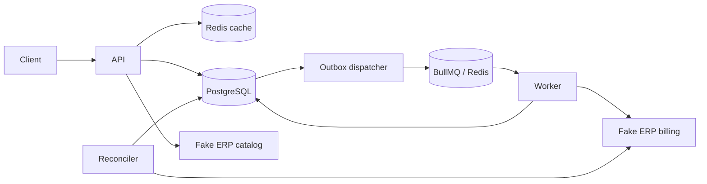

# CaseCellShop Backend

Serviço executável para o desafio sênior de backend. Implementa catálogo com cache Redis, checkout assíncrono com reserva de estoque no PostgreSQL, idempotência, transactional outbox, BullMQ, fake ERP, DLQ, reconciliação e observabilidade local. As [respostas conceituais](docs/conceptual-answers.md) e [decisões de arquitetura](docs/decisions) complementam o código.

## Executar

Requisitos: Node.js 22+, npm e Docker Compose.

```bash
cp .env.example .env
docker compose up -d --wait
npm ci
npm run db:migrate
npm run db:seed
npm test
npm run typecheck
npm run lint
npm run dev
```

No PowerShell, `Copy-Item .env.example .env` substitui o primeiro comando. O Compose publica PostgreSQL em `5432` e Redis em `6380`; ajuste Compose e `.env` juntos se essas portas estiverem ocupadas. `npm run dev` inicia API, dispatcher, worker e reconciliação no mesmo processo para simplificar a avaliação local. Para processos separados, defina `BACKGROUND_ENABLED=false` na API e execute `npm run worker` em outro terminal.

Teste manual:

```bash
curl http://localhost:3000/products
curl -X POST http://localhost:3000/checkout -H "content-type: application/json" -H "idempotency-key: example-1" -d '{"items":[{"productId":"case-iphone-15-black","quantity":1}]}'
curl http://localhost:3000/orders/<orderId>/status
npm run smoke
```

Repetir o POST com a mesma chave e os mesmos itens devolve o mesmo `orderId`; mudar os itens retorna `409`. O seed preserva estoque já alterado, então `npm run db:seed` não repõe unidades consumidas.

## Contrato e operação

| Endpoint                       | Comportamento                                                  |
| ------------------------------ | -------------------------------------------------------------- |
| `GET /products`                | Catálogo; `X-Cache: HIT/MISS/STALE` e `X-Request-Id`.          |
| `POST /checkout`               | Exige `Idempotency-Key`; retorna `202` com `orderId` e status. |
| `GET /orders/{orderId}/status` | Consulta estado persistido.                                    |
| `GET /health/live`             | Processo HTTP responde.                                        |
| `GET /health/ready`            | PostgreSQL e Redis acessíveis.                                 |
| `GET /metrics`                 | Métricas Prometheus.                                           |
| `GET /docs`                    | Swagger UI; contrato JSON em `/docs/json`.                     |

Erros usam `{ "error": { "code": "...", "message": "...", "requestId": "..." } }`. O contrato OpenAPI é gerado dos schemas das rotas. Logs e spans JSON incluem IDs de correlação/trace; nenhum corpo completo do checkout é logado. Exemplos de dashboards, alertas e resposta a incidentes estão no [runbook](docs/runbook.md).

## Arquitetura e garantias



O PostgreSQL controla estoque vendável e pedidos. A reserva usa `UPDATE ... WHERE available >= quantity` dentro da transação que cria pedido, itens e outbox. Itens são ordenados por `productId` e uma trava transacional por chave serializa retries simultâneos. O worker usa `orderId` como chave de faturamento idempotente; o fake ERP guarda a referência em `erp_invoices`. Um crash após publicar e antes de marcar a outbox pode gerar redelivery, que não cria uma segunda fatura.

O fake ERP usa tabelas locais para simular catálogo e faturamento. Isto mantém o case reproduzível sem tocar no ERP real; não representa a consistência eventual de uma integração remota. O cache guarda nome/preço e uma cópia stale, com TTL e jitter. A disponibilidade em `/products` é lida do inventário local em cada resposta, inclusive em cache hit, para refletir as reservas aceitas. Uma alteração externa de preço pode permanecer em cache até o TTL; não há sincronização real com o ERP neste desafio.

O worker marca `COMPLETED` após confirmação. Erro conhecido marca `FAILED` e libera a reserva. Timeout esgotado marca `RECONCILIATION_REQUIRED` e envia à DLQ; a reconciliação consulta o fake ERP. Pedidos `PROCESSING` envelhecidos são reconciliados. Na simulação, ausência de fatura na consulta é resposta definitiva; em um ERP real esta decisão exigiria contrato explícito de consulta.

Após confirmar o estado terminal, a reconciliação registra a resolução em `dlq_resolutions` e remove o job da DLQ; `dlq_depth` passa a refletir apenas pendências, e `dlq_messages_total` permanece como contador histórico.

## Verificação e cenários de falha

`npm test` cobre cache (miss, hit, TTL, stale, indisponibilidade e stampede), API, idempotência, rollback, overselling, outbox, redelivery, timeout, DLQ e reconciliação. Para repetir o teste de concorrência: `npm run test:concurrency`. `npm run build`, `npm run typecheck` e `npm run lint` completam a verificação local. `npm run reconcile` executa uma passagem manual.

O [CI](.github/workflows/ci.yml) executa migração, seed, testes, typecheck, lint e build em push e pull request para `main`, com PostgreSQL e Redis locais via Docker Compose.

O fake ERP aceita `ERP_CATALOG_MODE=normal|slow|error` e `ERP_BILLING_MODE=normal|slow|timeout|error|accept_then_timeout`. São parâmetros de execução/teste, não headers públicos. Redis indisponível afeta cache e fila: o catálogo tenta a fonte e a outbox fica pendente para republicação. PostgreSQL indisponível torna readiness `503` e impede novos checkouts, preservando a autoridade transacional.

## Trade-offs e limites

- Cache-aside reduz consultas à origem e fornece stale quando ela falha; expiração ainda permite preço antigo por até o TTL. Sem cache, a origem absorveria toda a carga. Refresh-ahead reduziria misses, mas adicionaria agendamento e maior complexidade.
- O `UPDATE` condicional com reserva evita overselling sem lock distribuído. Check-then-update não é seguro; lock pessimista explícito aumenta contenção. A coluna `reserved` permite distinguir unidades comprometidas de vendáveis.
- Persistir pedido antes de publicar diretamente na fila deixaria uma janela de perda; publicar antes de persistir cria mensagem fantasma. A outbox transacional fecha essa janela, aceitando entrega pelo menos uma vez e exigindo consumidor idempotente.
- Monólito modular mantém transações locais e execução simples. Serviços separados custariam mais operação e sincronização sem ganho demonstrado para o tamanho do case.
- O exporter de tracing grava spans JSON no stdout; não há coletor ou dashboard instalado. Metas de latência e SLOs são objetivos documentados, não resultados medidos sob carga de produção.

O projeto não implementa autenticação, pagamento, ERP real, sincronização externa de preço/estoque ou deploy cloud. Consulte o [runbook](docs/runbook.md) para alertas e recuperação. Prompts relevantes e revisão estão em [PROMPTS.md](PROMPTS.md).
