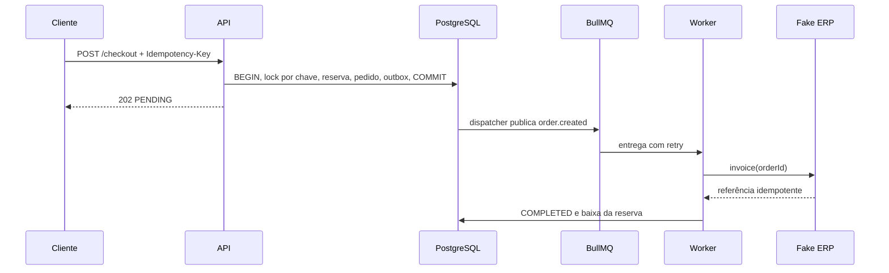

# Arquitetura

API e processos de background pertencem ao mesmo código-base. A API usa Fastify; PostgreSQL guarda produtos, inventário, pedidos, faturas simuladas e outbox; Redis guarda cache e filas BullMQ. O fake ERP lê o catálogo da projeção local e registra faturamento idempotente por `orderId`.

Traces propagam `traceparent` no payload da outbox até o worker. Logs JSON registram IDs, eventos e duração; métricas Prometheus não usam IDs de pedido ou request como labels. A API expõe `/metrics`. Quando o worker roda em processo separado, suas métricas residem naquele processo e precisam de endpoint/exporter próprio para coleta central; esta configuração local roda os componentes juntos por padrão.
